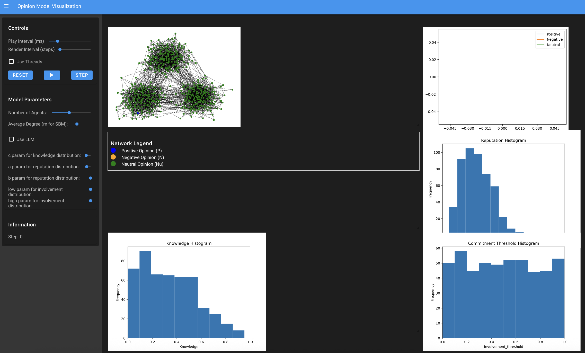

# Agent System Project — Simulation of Fake News Spread in Society Using LLM Agents

## Team Members
- Norbert Klockiewicz  
- Kacper Majchrzak  
- Arkadiusz Paterak  

---

## 1. Goal of the Project

In today’s highly connected digital world, *fake news* spreads rapidly across social networks and information platforms. This misinformation can have serious implications for societies. The **main objective** of our project is to understand and simulate how fake news spreads among communities of agents — some governed by **simple heuristics** and others driven by **LLMs** (Large Language Models).

We aim to explore:
- How does misinformation spread in connected agent-based societies?
- What differences emerge between LLM-based reasoning agents and rule-based agents?
- Can LLM-powered agents detect and suppress fake news?
  
---

## 2. State-of-the-Art and Literature Review

Research on **Agent-Based Models (ABMs)** for simulating social dynamics is well-known, especially in epidemiology and rumor spreading. Various models (SIR, Independent Cascade, etc.) have been applied to opinion sociology.

However:
- Integration of *language agents (LLMs)* into ABMs is a cutting-edge area.
- Few publications explore agents that use language understanding and reasoning to make context-aware decisions.
  
Helpful existing research:
- Usage of LLMs in agents for interactive fiction and exploration games.
- Rumor and fake news dispersion simulations using classical ABMs (not involving LLMs).

This positions our project in a **novel niche** where agents dynamically generate and evaluate messages using LLMs.

---

## 3. Data Used in the Project

### a. Data Source
No external dataset has been used. All messages and connectivity graphs are generated synthetically.

### b. Preprocessing
Since no real data is involved, data preprocessing is not required. 

Two hardcoded strings serve as:
- Fake news → `"There was an earthquake in Asia this month."`
- Fact → `"There was no earthquake in Asia this month."`

---

## 4. Used Model

### Community Model (Environment)

- Graph-based network of agents using `networkx`
- **Stochastic Block Model** used to generate sub-communities
- Each node is an agent

Parameters:
- `num_agents`: Number of nodes
- `n_communities`: Number of tightly-knit sub-graphs
- `use_llm`: Whether to initialize LLM-based agents

---

### Agent Types

#### 1. Classic OpinionAgent (non-LLM-based)
Attributes:
- `knowledge ∈ [0, 1]` - how well an agent can judge truth
- `opinion ∈ {-1, 0, 1}` - neg/neutral/pos
- `opinion_raw`: signal strength
- `reputation`: drawn from beta distribution
- `involvement`: = 1 initially, decreases over time
- `involvement_threshold`: controls whether agent spreads info
- `has_heard`: if agent ever received news

Spreads info based on product of opinion and reputation:
```python
payload = self.opinion * self.reputation
```
Opinion updated via:

```python
sigmoid_value = o_hat = 2 * (1 / (1 + exp(-5 * opinion_raw))) - 1
```

#### 2. LLMAgent
LLMs act as the “brain” of the agent. Each LLM agent:

Uses prompts to rephrase (when spreading)
Uses reasoning prompts to assess veracity of received news.
Attributes: includes all classic fields + llm, news, fake/fact strings provided at init.

## 5. Interactions
At each iteration:

#### 1. Spread Phase (spread_step)
Agents that are above involvement_threshold forward messages to neighbors
Classic agents forward a payload (math-based)
LLM agents send a rephrased message using:
Prompt for spreading:

Prompt for spreading:
```
You are an assistant that receives short news statements from the user. Your task is to rewrite the statement in your own words while preserving its original meaning. Do not evaluate or judge whether the news is  true or false — just rephrase it. Be concise, clear and answer only with rephrased news.
User: <input fake or factual news>
```

#### 2. Receiving / Updating Phase (update_step)

Classic agents accumulate message signal in opinion_raw and adjust belief using sigmoid.
LLM-agents analyze received messages using one of two prompts:
If agent has high knowledge , it evaluates message against a fact
If not, it evaluates alone

Prompt for checkgin news:

```
You are an assistant that receives short news statements. Your task is to determine whether the statement is factually correct or not. Respond with exactly one word: 
- Use "TRUE" if the statement is accurate.
- Use "FAKE" if the statement is not accurate. 
Do not explain or justify the answer.

User: {message_to_judge} The fact is: {optional_fact}
```

Based on the result, LLM agent sets its opinion:
- 1 → believes it is fake
- 1 → believes it is true

Involvement gradually decreases per timestep, eventually neutralizing once it hits zero.

## 6. How to Run the application

Install dependencies:
```
pip install -r requirements.txt
```

Run the Solara live dashboard using:
```
solara run server.py
```

#### Solara Panel Options
Customize:
- Number of agents
- Number of communities
- Toggle LLM mode ON/OFF

Visual elements:
- Network graph of opinions

Live histograms for:
- Knowledge,
- Agent reputation
- Involvement thresholds

You can also view:

- Central opinion dynamics with progress tracking
- Network snapshots using visualize_network_opinions(step_n)



## 7. Results and Conclusions

Our results indicate that the **LLM-based model successfully replicates trends observed in classical Agent-Based Models** for information and rumor spreading. In particular:

- **Both LLM agents and rule-based agents can simulate information diffusion effectively** across a network.
- The dynamics of fake news spread — including rapid propagation through low-knowledge nodes, and cluster-based opinion polarizations — were observed in both agent types.
- **LLM-augmented agents produce results consistent with prior literature**, validating the effectiveness of embedding cognitive reasoning into ABMs.

### Key insights:
- In simulations, **LLM agents displayed more dynamic, context-aware responses**, correctly classifying messages depending on agent knowledge and message formulation.
- **Higher knowledge agents** were consistently more resistant to fake news, especially in LLM setups where news could be critically evaluated.
- **Classic agents showed quicker but more rigid convergence**, while LLM agents adjusted opinions more credibly over time.
- **Communities composed partly or fully of LLM agents slowed the spread and dampened the polarization**, producing more stable or nuanced opinion distributions.

### Conclusion:
This project demonstrates that **LLMs can serve as powerful cognitive engines within agent-based social simulations**, offering:
- More human-like reasoning,
- Greater flexibility in processing evolving content, and
- The potential for real-time misinformation detection strategies.

Overall, we conclude that **LLM-empowered agents are not only viable alternatives to traditional agent decision models but have clear advantages** in realism, adaptability, and future extensibility.

## 8. Interesting Problems Encountered
- LLM response time was slower due to real-time generation. Minimization of tokens and prompt optimization helped.
- Visualization complexity — balancing clarity and scale in graph view for medium-to-large networks.

## 9. Possible Future Development
- Use multiple chat models (e.g. OpenAI, Claude, Mistral, Gemini)
- Introduce more complex news & multi-topic ecosystems , not binary fake/fact.
- Include platform bias algorithms — mimicking Twitter/FB’s echo chambers
- Enable agent memory or long-term learning
- Incorporate real misinformation examples from datasets (e.g., LIAR dataset)

## 10. Project Repository
https://github.com/kacpermajchrzak/AgentSystem

## 11. References / Bibliography
- [Multi-Agent Systems Powered by Large Language Models: Applications in Swarm Intelligence](https://paperswithcode.com/paper/multi-agent-systems-powered-by-large-language)
- [CS 222: AI Agents and Simulations](https://joonspk-research.github.io/cs222-fall24/index.html)
- [Przewodnik po systemach wieloagentowych w 2025 r.](https://joonspk-research.github.io/cs222-fall24/index.html)
- [AUTOGEN STUDIO: A No-Code Developer Tool for Building and Debugging Multi-Agent Systems](https://arxiv.org/pdf/2408.15247v1)
- [Agent Hospital: A Simulacrum of Hospital with Evolvable Medical Agents](https://arxiv.org/abs/2405.02957)
- [Multi-Agent Surveillance System Of Fake News Spreading In Scale-Free Networks](https://www.sciencedirect.com/science/article/pii/S1877050922011693?ref=pdf_download&fr=RR-2&rr=93dae8117db9bfd5)